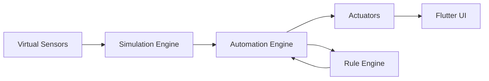

# 🌆 UrbanOS – Smart City Digital Twin Simulator

<p align="center">
  
</p>

<p align="center">
  <b>A futuristic, enterprise-grade smart city control platform built with Flutter</b>
</p>

---

## 🎥 Demo Video

<p align="center">
  <a href="https://drive.google.com/file/d/1j3dqfpciImDbg1GguYuvS5oRaL4lzaIW/view">
    
  </a>
</p>

## 🚀 Tech Stack & Status

<p align="center">


</p>

---

## 🌟 Overview

UrbanOS is a **Digital Twin simulation platform** that models how a real autonomous smart city operates.

It integrates:

* Virtual IoT Sensors 📡
* Automation Engine 🤖
* Simulation Engine 🔁
* Actuator Systems ⚙️
* Real-time Flutter UI 🎯

All working together to simulate a **fully automated smart city ecosystem** — without physical hardware.

---

## 🧠 Key Features

### ⚙️ Core Systems

* Real-time simulation engine
* Rule-based automation engine
* Modular scalable architecture
* Complex business logic handling
* Reactive UI updates

---

### 🚦 Traffic System

* Smart traffic light control
* Adaptive signal timing
* Accident monitoring
* Parking analytics
* Road-level insights

---

### ⚡ Energy & Utilities

* Power grid monitoring
* Consumption analytics
* Water management system
* Load balancing simulation

---

### 🌿 Environment Monitoring

* AQI tracking
* Weather simulation
* Pollution analytics
* Noise & humidity sensors

---

### 🚨 Safety & Emergency

* Fire detection system
* CCTV activity tracking
* Emergency override system
* Crowd density monitoring

---

### 🤖 Automation Engine

* Rule-based decision making
* Priority-based conflict resolution
* Dynamic actuator control
* Real-time state updates

---

## 🧩 System Architecture



---

## 🧠 Architecture Explanation

UrbanOS follows a reactive pipeline:

* Sensors generate simulated data
* Simulation Engine updates system state
* Automation Engine evaluates rules
* Rules trigger actuator responses
* UI reflects changes in real-time

---

## 🏙️ Digital Twin Concept

Every entity in the city exists as a **software object**:

* Districts
* Roads
* Buildings
* Sensors
* Actuators
* Automation Rules

This creates a complete **virtual representation of a real city**.

---

## 🧪 Automation Engine

### Rule Format

```
IF <condition>
THEN <action>
PRIORITY <level>
```

### Example Rules

* If AQI > 150 → Enable air filters
* If traffic > 80 → Extend green signal
* If rain detected → Reduce speed limits
* If power overload → Disable non-critical zones

---

## 📸 Screenshots

<p align="center">
  
  
  
</p>

<p align="center">
  
  
  
</p>

<p align="center">
  
  
  
</p>

<p align="center">
  
  
  
</p>

<p align="center">
  
  
  
</p>

<p align="center">
  
  
</p>

---

## 🔐 Authentication

* Firebase Authentication
* Login / Signup
* Forgot Password
* Secure user flow

---

## 📊 Project Scale

* 40+ screens
* Multiple subsystems
* Complex UI interactions
* Real-time simulation
* Scalable architecture

---

## 📁 Project Structure

```
lib/
├── core/
├── models/
├── services/
├── providers/
├── screens/
├── widgets/
└── mock_data/
```

✔ Clean architecture
✔ Separation of concerns
✔ Scalable design

---

## 🛠️ Tech Stack

* Flutter
* Dart
* Provider (State Management)
* Firebase Authentication
* Firestore Database
* Custom Simulation Engine
* Custom Automation Engine

---

## 🎨 UI / UX Highlights

* 🌙 Premium dark theme
* ✨ Glassmorphism design
* ⚡ Smooth animations
* 📊 Data-driven dashboards
* 🎯 Clean & modern UI

---

## 🚀 Getting Started

```bash
git clone https://github.com/TanimStu068/urban-os.git
cd urban-os
flutter pub get
flutter run
```

---

## 🔮 Future Enhancements

* AI-based prediction engine
* MQTT / real IoT integration
* Multi-city simulation
* Role-based dashboards
* Cloud sync
* Web version

---

## 🧠 What This Project Demonstrates

* Advanced Flutter development
* System design & architecture
* State management expertise
* Real-world problem modeling
* Scalable app structure

---

## 📌 Vision

> “A scalable IoT-based autonomous city management platform”

UrbanOS represents the future of **smart cities and digital twin systems**.

---

## 👨‍💻 Author

**Tanim Mahmud**

---

## ⭐ Support

If you like this project:

* ⭐ Star the repo
* 🍴 Fork it
* 🧠 Share feedback

---
